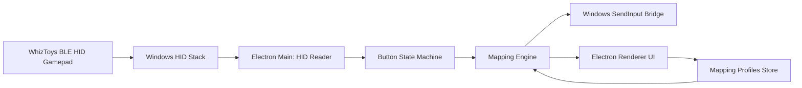

# WhizToys HID Key Mapper Plan

## Current Firmware HID Behavior

The joystick firmware advertises as a BLE gamepad named with the `-jyt` suffix, for example `WTS2-jyt`. In `JoystickMode::init`, the device name is set, BLE appearance is set to gamepad, and `HIDService::init` registers the standard BLE HID service:

- [`JoystickMode.cpp`](/Users/g-tech/whiz-toys/whiztoys_unified/JoystickMode.cpp)
  - `ble.setDeviceName(... "-jyt")`
  - `ble.setAppearance(GapAdvertisingData::GAMEPAD)`
  - `HIDService::init(ble)`

The HID report descriptor in [`HIDService.cpp`](/Users/g-tech/whiz-toys/whiztoys_unified/HIDService.cpp) defines a standard gamepad with:

- Usage Page: Generic Desktop
- Usage: Game Pad
- Report ID: `1`
- Buttons: `Button 1` through `Button 8`
- Axes: `X` and `Y`, each signed 8-bit from `-127` to `127`

The actual firmware report payload is three bytes:

```text
byte 0: buttons bitmask, 8 buttons
byte 1: X axis, currently always 0
byte 2: Y axis, currently always 0
```

Because the HID descriptor includes `Report ID 1`, Windows or `node-hid` may expose reports as either:

```text
[buttons, x, y]
```

or with the report ID prepended:

```text
[1, buttons, x, y]
```

The desktop app must normalize both shapes.

Button bit meaning:

```text
bit 0 -> Button 1
bit 1 -> Button 2
bit 2 -> Button 3
bit 3 -> Button 4
bit 4 -> Button 5
bit 5 -> Button 6
bit 6 -> Button 7
bit 7 -> Button 8
```

The firmware sends reports only when the bitmask changes. `JoystickMode::onSensorsUpdated()` builds `_buttonsState`, compares it with the previous state, then calls `HIDService::sendGamepadReport(_buttonsState, 0, 0)`.

The tile-to-button order comes from `WhizCarpet::getOrderedTileLayout()`. It iterates `_carpet_id_map`, which is keyed by zero-padded row/column strings such as `0000`, `0001`, etc. That means Button 1 generally corresponds to the first present tile in row-major key order, Button 2 to the next present tile, and so on.

Important implication: the desktop app does not know row/column directly from HID. It only sees gamepad buttons. The app should label inputs as `Button 1` to `Button 8` unless a future firmware/app-side GATT endpoint exposes tile layout metadata in joystick mode.

## Recommended Architecture

Use Electron with a TypeScript renderer and a Node main process. Keep HID reading and keyboard injection in the main process; keep UI, mapping editing, and visual feedback in the renderer.



## Core Modules

Create these app modules:

- `main/hid/deviceDiscovery.ts`

  - Enumerate HID devices using `node-hid`.
  - Filter for likely WhizToys joystick devices by product/manufacturer/name where available.
  - Fall back to devices whose HID usage page/usage match gamepad if name metadata is incomplete.

- `main/hid/reportReader.ts`

  - Open selected HID device.
  - Listen for input reports.
  - Normalize `[buttons, x, y]` and `[1, buttons, x, y]` into `{ buttons: number, x: number, y: number }`.
  - Emit high-level button events: `pressed`, `released`, `held`.

- `main/mapping/mappingEngine.ts`

  - Convert button transitions into configured desktop actions.
  - Support per-button key mappings, for example `Button 1 -> ArrowUp`, `Button 2 -> Space`.
  - Avoid repeated keydown spam by tracking active keys.
  - On button press: send keydown.
  - On button release: send keyup.

- `main/native/windowsInput.ts`

  - Implement keyboard output using Windows `SendInput`.
  - Use a native module, FFI, or a maintained package that wraps `SendInput`.
  - Prefer direct `SendInput` over browser keyboard events because the app must control other desktop apps.

  - `main/store/profileStore.ts`
  - Persist mappings as JSON under Electron `app.getPath('userData')`.
  - Store device ID, profile name, button mappings, and options like debounce/hold behavior.

- `renderer/components/MappingEditor.tsx`

  - Show 8 buttons.
  - Let the user click a button and press a keyboard key to bind it.
  - Display live input state when the mat is pressed.

- `renderer/components/DeviceStatus.tsx`
  - Show disconnected, connected, reading reports, and error states.

## Data Model

Use a simple versioned JSON profile:

```json
{
  "version": 1,
  "activeProfileId": "default",
  "profiles": [
    {
      "id": "default",
      "name": "Default",
      "deviceName": "WTS2-jyt",
      "bindings": {
        "button1": { "type": "key", "key": "ArrowUp" },
        "button2": { "type": "key", "key": "ArrowDown" },
        "button3": { "type": "key", "key": "ArrowLeft" },
        "button4": { "type": "key", "key": "ArrowRight" },
        "button5": { "type": "key", "key": "Space" },
        "button6": { "type": "key", "key": "Enter" },
        "button7": { "type": "key", "key": "Escape" },
        "button8": { "type": "key", "key": "Tab" }
      }
    }
  ]
}
```

## HID Report Parsing Rules

Implement parsing defensively:

```ts
function normalizeReport(data: Buffer): HidGamepadReport | null {
  if (data.length >= 4 && data[0] === 1) {
    return { buttons: data[1], x: toInt8(data[2]), y: toInt8(data[3]) };
  }

  if (data.length >= 3) {
    return { buttons: data[0], x: toInt8(data[1]), y: toInt8(data[2]) };
  }

  return null;
}
```

State transition logic:

```text
previousButtons XOR currentButtons = changedMask
changed bit from 0 to 1 -> pressed
changed bit from 1 to 0 -> released
unchanged bit 1 -> held
```

The first implementation should ignore X/Y axes because firmware currently sends `0, 0`.

## Desktop Key Injection Behavior

The key mapper must preserve press/release semantics:

- When Button 1 goes down, send `keydown(ArrowUp)` once.
- While Button 1 remains held, send no extra events by default.
- When Button 1 goes up, send `keyup(ArrowUp)` once.
- On device disconnect or app quit, release every currently-held virtual key.

Add optional later modes:

- `tap`: press and release key immediately on button down.
- `hold`: keydown on button down, keyup on release.
- `repeat`: repeat while held at a configured interval.
- `combo`: map one button to multiple keys, for example `Ctrl+S`.

## Device Discovery UX

Windows may expose BLE HID metadata inconsistently, so the first version should support both automatic and manual selection:

- Auto-scan candidate HID devices.
- Prefer device names containing `WTS`, `WhizToys`, or `-jyt` when available.
- Show all gamepad-like HID devices in an advanced list.
- Add a “press any WhizToys tile” detection flow: open candidates one at a time or listen to selected candidate, then highlight if a report changes.

## Mode Management

The desktop HID key mapper should assume the device is already in joystick mode. Switching from carpet mode to joystick mode requires BLE GATT writes to ModeService:

- Service: `0xFEA0`
- Current mode: `0xFEA1`, read `0x00` carpet or `0x01` joystick
- Set mode: `0xFEA2`, write `0x01` to switch to joystick
- Firmware reboots about 500ms after write, then reconnects/advertises as `-jyt`

For the first Windows Electron implementation, make mode switching optional. It can be implemented later with a BLE library or a small helper flow. The HID mapper itself should work once Windows has paired the BLE device as a game controller.

## Implementation Phases

1. Set up Electron + TypeScript app skeleton.
2. Add `node-hid` or equivalent HID access and list Windows HID devices.
3. Build a diagnostic screen that shows raw report bytes and normalized `{ buttons, x, y }`.
4. Implement button transition detection for 8 buttons.
5. Implement profile JSON storage and default mappings.
6. Implement Windows keyboard injection through `SendInput`.
7. Wire mapping engine: HID transitions -> configured keydown/keyup.
8. Build mapping editor UI with “press a tile to assign” flow.
9. Add safety handling: release all keys on disconnect, app blur, quit, crash guard.
10. Package for Windows and test after pairing device in Windows Bluetooth settings.

## Risks And Constraints

- HID access on Windows may vary between `node-hid`, Raw Input, and GameInput APIs. If `node-hid` cannot open the BLE gamepad because Windows claims exclusive access, implement a Windows Raw Input native module instead.
- Electron browser Gamepad API is easier but usually requires app focus and is not ideal for background key mapping.
- The current firmware exposes only 8 buttons; key mapper UI should not assume more buttons until HID descriptor changes.
- The app cannot infer physical tile row/column from HID alone. It can only map `Button 1` through `Button 8` unless firmware exposes layout metadata over another service in joystick mode.
- Keyboard injection can trigger antivirus or game anti-cheat protections. Use standard Windows `SendInput` and document expected limitations.

## Suggested Agent Instructions

Tell the implementation agent:

- Build Windows-first Electron + TypeScript.
- Keep HID I/O and keyboard injection in Electron main process.
- Use IPC to send sanitized button state to renderer.
- Do not rely on renderer DOM key events for global output.
- Normalize both 3-byte and 4-byte HID report shapes.
- Treat firmware HID report byte 0 as button bitmask after optional Report ID.
- Implement held-key cleanup on disconnect and app shutdown.
- Start with `Button 1` to `Button 8` labels, not tile coordinates.
- Make mode switching a separate later feature unless BLE GATT integration is explicitly requested.
